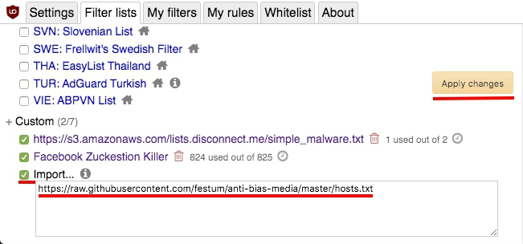

# anti-bias-media

[ENG](README.md)

大陸與財團買了許多媒體公司，這些媒體公司因利益關係會做不公正報導。目前先根據維基百科的親共媒體建立[[1](https://zh.wikipedia.org/wiki/%E8%A6%AA%E4%B8%AD%E5%AA%92%E9%AB%94)][[2](https://zh.wikipedia.org/wiki/%E7%B5%B1%E6%B4%BE%E5%AA%92%E9%AB%94_(%E5%8F%B0%E7%81%A3))]清單。洗腦機器太多，很容易一不小心就看到洗腦頻道。為了省去看新聞還要追查出處的困擾，直接用本清單阻擋較省時。

歡迎大家補充連結！

## 如何安裝

1. 因應瀏覽器或裝置下載外掛廣告阻擋器(如：[uBlock Origin](https://chrome.google.com/webstore/detail/ublock-origin/cjpalhdlnbpafiamejdnhcphjbkeiagm))，下載連結：[Chrome](https://chrome.google.com/webstore/detail/ublock-origin/cjpalhdlnbpafiamejdnhcphjbkeiagm)/[FireFox](https://addons.mozilla.org/en-US/firefox/addon/ublock-origin/)/[Edge](https://www.microsoft.com/en-us/p/ublock-origin/9nblggh444l4?activetab=pivot:overviewtab)/[Rooted Android](https://adaway.org/)
2. 在過濾清單分頁中勾選匯入並貼上網址 `https://raw.githubusercontent.com/festum/anti-bias-media/master/hosts.txt`

3. 別忘了按確認
