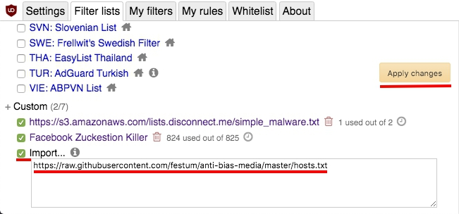

# anti-bias-media

[中文](README-zh_TW.md)

CPC bought many media companies spreading manipulated news confusing publics. This list is start based on media list from wiki [[1](https://zh.wikipedia.org/wiki/%E8%A6%AA%E4%B8%AD%E5%AA%92%E9%AB%94)][[2](https://zh.wikipedia.org/wiki/%E7%B5%B1%E6%B4%BE%E5%AA%92%E9%AB%94_(%E5%8F%B0%E7%81%A3))].

Please feel free to add related site belong to these parties.

## Installation

1. Add AD blocker (ex: [uBlock Origin](https://chrome.google.com/webstore/detail/ublock-origin/cjpalhdlnbpafiamejdnhcphjbkeiagm)) to your browser. DL: [Chrome](https://chrome.google.com/webstore/detail/ublock-origin/cjpalhdlnbpafiamejdnhcphjbkeiagm)/[FireFox](https://addons.mozilla.org/en-US/firefox/addon/ublock-origin/)/[Edge](https://www.microsoft.com/en-us/p/ublock-origin/9nblggh444l4?activetab=pivot:overviewtab)/[Rooted Android](https://adaway.org/).
2. Import custom filter list `https://raw.githubusercontent.com/festum/anti-bias-media/master/hosts.txt` and apply.

